# 结对作业二：校园失物招领 —— 核心功能代码实现

> **提交前请替换以下占位内容（搜索「【」）**
> 1. 两位同学的学号姓名、博客链接、本次作业博客链接、GitHub 仓库地址；
> 2. 第 2 节「具体分工」、第 9 节「遇到的困难及解决」、第 10 节「评价队友」——这三节必须你们自己写；
> 3. 第 8 节需要自行截图 GitHub 的 commit 记录；
> 4. 博客园发帖时，把文中 ``、`` 的图片用博客园「上传图片」功能上传后替换为图床地址。

---

| 项目 | 地址 |
| --- | --- |
| 结对同学 A 的博客 | 【https://www.cnblogs.com/xxx/】 |
| 结对同学 B 的博客 | 【https://www.cnblogs.com/yyy/】 |
| 本次作业博客 | 【https://www.cnblogs.com/xxx/p/zzz.html】 |
| GitHub 仓库地址 | 【https://github.com/xxx/2023001-2023002】 |

学号姓名：【2023xxxxx 张三】 ｜ 【2023xxxxx 李四】

---

## 一、这次要做的东西

第一次结对作业我们用墨刀做了「校园失物招领」的原型：首页浏览、关键词搜索、发布寻物/招领、查看详情、我的发布，还设计了一个**认领验证**的机制。这次要把它变成真的能跑的程序。

> **本篇按真实开发过程写，包括中途的一次大改版。** 第一版认领验证做成了"系统预设问题 + 随机抽题 + 手打答案"，写完之后我们发现它在**判定准确性**和**防试探**两件事上都不成立，于是把这一块整体推翻，换成**纯客观题（判断题 / 选择题）+ 限制 3 次 + 失败转人工审核**。改版的来龙去脉写在 4.4 与 5.2 节，文中所有代码、截图、用例数都与当前仓库一致（262 个用例）。

任务书对这次的要求很明确：完成「**发布信息 → 浏览/搜索 → 查看详情 → 联系发布者 → 更新状态**」这条主线，不要求复杂后台、实名认证、即时聊天、地图定位。

我们选的是 **PC 端 Web 网页**，但保留移动端形态——同一套 HTML 在宽屏下是桌面网页版（顶部导航 + 右侧卡片网格 + 左侧筛选栏），在窄屏下自动变成第一次作业原型那种手机版（底部 Tab 栏）。这样助教在电脑上打开看到的是像样的网页，用手机打开也依然好用。

### 技术底线（这几条决定了后面所有选择）

| 约束 | 由此产生的决定 |
| --- | --- |
| 助教下载仓库后**双击 HTML 就要能用** | 不用任何需要构建步骤的方案，不用 npm，不用脚手架 |
| 不能起本地服务器 | 不能用 ES Module（`file://` 下会被 CORS 拦），不能用 `fetch` 读 JSON |
| 不能联网 | 第三方库必须随仓库提交，不能用 CDN |
| 没有后端 | 数据存在浏览器本地 |

---

## 二、具体分工

> 【这一节请两位同学自己写。建议写清谁负责哪几个模块、谁写的测试、文档谁主笔、两人共同做了什么（比如一起定数据模型、一起走查流程）。评分点是「给出具体分工」1 分，含糊的「共同完成」拿不到分。】

| 成员 | 负责内容 |
| --- | --- |
| 【张三】 | 【例如：数据层 store.js、单元测试、README】 |
| 【李四】 | 【例如：界面与响应式、8 个页面控制器、博客排版】 |
| 共同 | 【例如：一起定数据模型与状态流转规则、一起走查全流程】 |

---

## 三、PSP 表格

> 完整的 PSP 表格见仓库 `docs/PSP表格.md`，以及第 9 节对超时环节的分析。

| PSP2.1 | 预估耗时（分钟） | 实际耗时（分钟） |
| --- | --- | --- |
| Planning 计划 | 20 | 【】 |
| Analysis 需求分析 | 60 | 【】 |
| Design Spec 生成设计文档 | 30 | 【】 |
| Design Review 设计复审 | 20 | 【】 |
| Coding Standard 代码规范 | 15 | 【】 |
| Design 具体设计 | 60 | 【】 |
| Coding 具体编码 | 300 | 【】 |
| Code Review 代码复审 | 30 | 【】 |
| Test 测试 | 40 | 【】 |
| Reporting 报告 | 145 | 【】 |
| **合计** | **720** | **【】** |

> ⚠️ **实际耗时请务必按真实记录填写。** 题目说明里专门批评过「预估耗时与实际耗时完全一致」的 PSP 表，并指出 PSP 的价值在于发现哪些环节被低估、哪里发生了返工。全对得漂亮不如如实记录 + 分析原因。

---

## 四、解题思路与设计实现

### 4.1 代码实现思路

**一句话概括：把「业务规则」和「界面」彻底分开，让规则能被测试，让界面只管显示。**

原型阶段我们已经把功能列清楚了，但真写代码时遇到的第一件事是：**哪些东西必须做对，做错了后果严重？**

想了一圈，有四个：

1. **验证题的正确答案不能泄露**——这是防冒领机制的根基，一旦答案能从列表页、详情页或答题页的数据里扒出来，整个设计就废了；
2. **状态流转不能乱**——东西已经还回去了，信息还挂着「待认领」，别人就会白跑一趟，这正是需求里要解决的痛点；
3. **只有发布者能改自己的信息**——没有账号体系的前提下，这条得靠本机身份标识来兜；
4. **搜索得搜得到**——搜「校园卡」找不到「校园卡一张（学号 2023****）」，用户就不用了。

这四件事全都是"输入 → 输出"的逻辑，跟界面上长什么样没关系。所以我们的做法是：**把它们全部抽到一个数据层 `js/store.js` 里，界面层只负责调方法和画界面。**

这样安排之后，一个额外的好处出现了：**这些规则可以被单元测试完整覆盖，而且不需要浏览器环境。**

实现上最关键的一步在这里——数据层的存储是**注入**进去的：

```js
// js/store.js
LF.createStore = function (storage, options) {
  // storage 只要求提供 getItem / setItem / removeItem 三个方法，
  // 和 localStorage 的接口完全一致
};
```

于是：

```js
// 浏览器里这样用
LF.createStore(window.localStorage)

// 单元测试里这样用
LF.createStore(LF.createMemoryAdapter())   // 内存实现，每个用例互不干扰
```

业务代码一个字都不用改。测试因此不需要 jsdom、不需要起服务器、不需要装 Node.js——双击 `test/test.html` 就能跑。

整体分层：

```
页面 HTML          只管结构
     ↓
page-*.js          收集输入、调数据层、渲染结果
     ↓
store.js      ★    全部业务规则（校验 / 搜索 / 状态流转 / 认领比对）
     ↓
utils.js           纯函数：时间格式化、文本归一化、图片压缩
     ↓
存储适配器          localStorage → sessionStorage → 内存，依次降级
```

### 4.2 数据流图

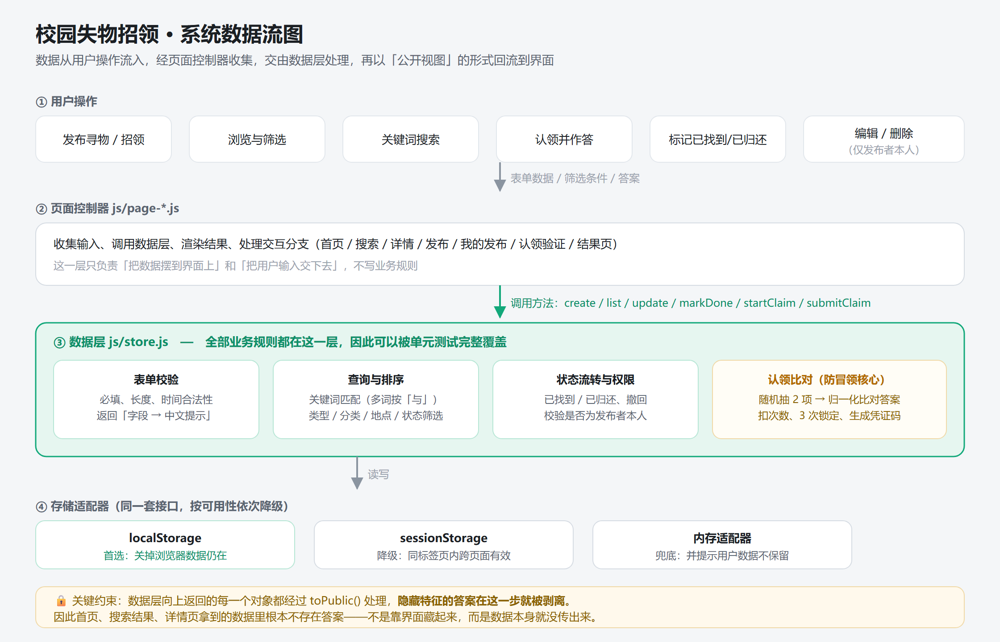

图中最重要的一条是底部那句：**数据层向上返回的每一个对象都经过 `toPublic()` 处理，每道题的正确答案（`answer` 下标）在这一步就被剥离，认领记录与申诉明细同样不外传。** 首页、搜索结果、详情页、答题页拿到的数据里根本不存在正确答案——不是靠界面藏起来，而是数据压根没传出来。

### 4.3 一个差点漏掉的收尾：把公开特征"一刀切"之后，得告诉失主该搜什么

防泄漏那一刀（非「其他」分类只露出定死的 1–2 项特征、取消自由描述）砍下去之后，我们以为事情就完了，其实只做了一半：**信息面收窄的代价，最后是失主承担的。** 而且这一节还留了个尾巴——有一类物品根本没法"露特征"，得单独处理，见下一节。

失主的习惯是搜描述里的词——「蓝色充电宝」「伞柄有划痕」。这些词在收窄之后已经不存在于公开面里了（描述框被数据层强制置空），于是搜出来 0 条。而**"0 条结果"和"没人捡到"在页面上长得一模一样**，他不会怀疑自己搜错了，只会认为东西没人捡到，然后放弃。这才是这一刀真正的副作用：不是信息少了，而是**用户无从知道信息少了**。

所以每个分类都要自己交代清楚。分类字典里加一个 `searchHint`，首页选中分类时显示在筛选区旁（手机端在筛选条下面）：

| 分类 | 页面上的引导语 |
| --- | --- |
| 证件卡片 | 🔍 本类只公开卡号：请按证件号搜索（记不全的位用 `*` 顶位，位数要和卡号一样长），姓名、院系、卡号之外的细节都不公开。（卡号（打码））（就是全部可搜的公开特征） |
| 电子产品 | 🔍 本类只公开品牌和型号：请按品牌或型号搜索，颜色、外观、保护壳都不在公开信息里。（品牌、型号）（就是全部可搜的公开特征） |
| 耳机 | 🔍 本类只公开品牌和颜色：请按品牌或颜色搜索，充电盒、外观磨损这类细节不公开。 |
| 雨伞 | 🔍 本类只公开伞面颜色和柄型：请按颜色或柄型搜索，图案、划痕这类细节不公开。 |
| …… | 有特征的分类各一条，写法同上 |
| 其他 | 🔍 这一类不好指定公开特征，也不出认领验证题：描述和照片直接公开，请翻列表（或用描述里的词、按地点）找，翻到了直接联系发布者核对。 |

三个决定值得记一笔：

1. **不是"请搜 X"，而是"请搜 X，Y 搜不到"。** 只告诉失主搜得动的字段，他不知道"颜色"根本不在公开面里，照样会去搜。所以每条引导语都带一句"哪些细节不公开"。
2. **显不显示由字典决定，不维护第二份名单。** `LF.searchHintFor()` 只读 `LF.CATEGORIES[].searchHint` 这一份数据：写了就显示、没写就返回空串由页面隐藏。所以脏数据里的未知分类天然没有引导，页面不用维护分类名单。
3. **引导语自己会"认错"。** 特征名和引导语存在两个地方，最容易出的岔子是改了字段名忘了改文案。所以 `LF.searchHintFor()` 会检查 `searchHint` 里有没有提到字典里的字段名，没提到就把它附在后面自曝其短；`validate.spec.js` 里还有一组成用例直接断言"每个特征名都必须出现在引导语里"（"搜索引导：每个分类都要告诉失主该搜什么"一节）。

**原有的特征筛选按钮一个没删。** 引导语讲的是"关键词该怎么搜"，而侧栏那组按品牌/颜色的筛选按钮本身就能用（点「华为」直接筛出华为耳机），两者互补：会搜的用搜索框，不会搜的点按钮。这一条是刻意保留的取舍。

### 4.3.1 补上对照组：「其他」类不出验证题

把上面那套"锁定特征 + 出题验证"推到底，就会撞到一个绕不开的分类：**「其他」**。它之所以是「其他」，正是因为这一类物品没有客观、能锁死的细节——一本书、一串钥匙、一个说不清型号的充电器。我们对它做过一个自问：**这一类该出什么题？** 答案是：出题人只能把描述里的细节再抄一遍（"扉页上写着谁的名字"配上描述里的"扉页有名字"），同一份信息写两次，而且冒领者照着公开描述就能选对——**在一类根本没有可锁特征的信息上强制出题，只会逼人编题。**

所以这一类改成**对照组**，走**信任原则**：**不设认领验证题**，描述和照片直接公开，联系方式直接可见，见到的人直接联系发布者核对。

| 分类 | `LF.allowVerifyFor()` | 出题 | 谁看得到联系方式 |
| --- | --- | --- | --- |
| 有公开特征的八类 | `true` | 必须出 3–5 题 | 答对全部题目的人 |
| 其他 | `false` | **不出题** | 所有人（公开） |
| 字典里没有的分类（脏数据） | `null` | 不校验 | 分类字段自己已经报错，不再叠加 |

四个实现上的决定，都是被具体问题逼出来的：

1. **判断收在一个函数里，页面不写分类名。** 依据是"这个分类有没有公开特征定义"（`LF.featuresFor`），不是手写 `category === 'other'`：将来真出现第二个"不出题"的分类，只改这一处。返回**三态**而不是布尔是为了第三行的脏数据：分类压根不在字典里时，"该不该出题"无从判断，返回 `null` 让校验跳过，免得在"分类错误"之上再叠一条用户改不掉、也无从理解的"请至少出 3 道验证题"。
2. **数据层说了才算，前端藏了不算数。** `store.create` / `store.update` 对「其他」**强制把 `questions` 置空**（和"描述按分类置空"是同一个套路），前端就算传了题目也落不了盘；`needsVerify()` 对「其他」恒为 false，认领入口 `startClaim()` 直接回"这条信息不需要验证"。
3. **旧数据必须就地清掉（`DATA_VERSION` 3 → 4）。** 演示数据 `seed_6` 原本给这一类挂着 4 道题，v3 时代的真实数据也可能有。如果只改新流程，这些老记录会继续按老规矩要求认领者答题，而**发布页已经不再提供题目编辑入口**——发布者连"把这套题删掉"都做不到，等于被永久锁在旧流程里。所以迁移把它们清空、作答次数一并复位。
4. **页面要给"去处"，不能只是把出题区一藏了事。** 发布者点开一个空白的出题区会以为功能坏了。所以选中「其他」时，出题区换成一整块说明：为什么不出题、描述和照片会直接公开、**代价**是没有防冒领闸门（所以别把唯一凭据——"书里夹着一张写名字的借书凭条"——写进公开描述）。详情页、我的发布、发布成功页也各说一句，免得认领人以为页面坏了、发布者以为自己漏填了。

**这条改动是有代价的，我们把它写进了「已知限制」**：这一类没有防冒领闸门，理论上谁先看到都能联系发布者。换来的是这个分类终于有一个说得通的流程，而不是一个逼着人编题的流程。

### 4.4 关键实现的流程图：认领验证（含一次大改版）

这是本项目最核心的一段逻辑，也是第一次作业原型里最有价值的原创点。

要解决的问题很具体：**招领信息如果把联系方式直接公开，任何人都能看到，真正的主人反而可能被抢先联系。** 但完全不给联系方式，又没法线下交接。

**第一版（原型方案）**：发布招领信息时按物品分类设置 2–3 项只有物主才知道的特征（证件卡片问卡面姓名 / 卡号后四位 / 卡面标记，雨伞问伞面颜色 / 伞柄特征……），认领时随机抽 2 项，让认领人**手打**答案，全部答对才解锁联系方式。

做完自测之后，我们对着评审意见把这条路重走了一遍，发现两个绕不开的毛病：

| 毛病 | 具体表现 | 后果 |
| --- | --- | --- |
| **判不准** | 发布者写「深蓝色」，失主记得是「藏青」；发布者写「蓝色小熊贴纸」，失主写「小熊贴纸」 | 真失主被拦在外面。为了宽容就得做文本归一化，而"宽容到什么程度"本身没有正确答案 |
| **能试探** | 为了让失主知道错在哪，页面必须指出答错的题（否则他无从下手） | 每答错一次就排除一个选项，**3 次机会足够把答案试出来**，限制次数形同虚设 |

**第二版（本仓库采用的方案）：纯客观题 + 限制次数。** 把判定从"文本比对"换成"选项比对"，从根上消掉这两个问题：

- **拾得者出题，只允许判断题和选择题**，题量 3–5 题（建议 4 题），选择题 2–4 个选项并指定正确答案；系统再按物品分类给出题模板，降低出题门槛；
- **认领者一次性答完全部题目再提交**，每题只能点选项，没有自由文本；
- **系统统一判定，只回"通过 / 不通过"**：未通过时提示语统一为「回答的细节与描述不符」，**不告诉他是哪一题错**——没有排除法的线索，3 次机会就真的只剩 3 次；
- **最多答 3 次**，答对不消耗次数；发布者换了题目则重新给满 3 次；
- **3 次全败后解锁【申诉】**，认领者写下只有物主才知道的细节和联系方式，进入人工审核通道，由拾得者判断是否交还。

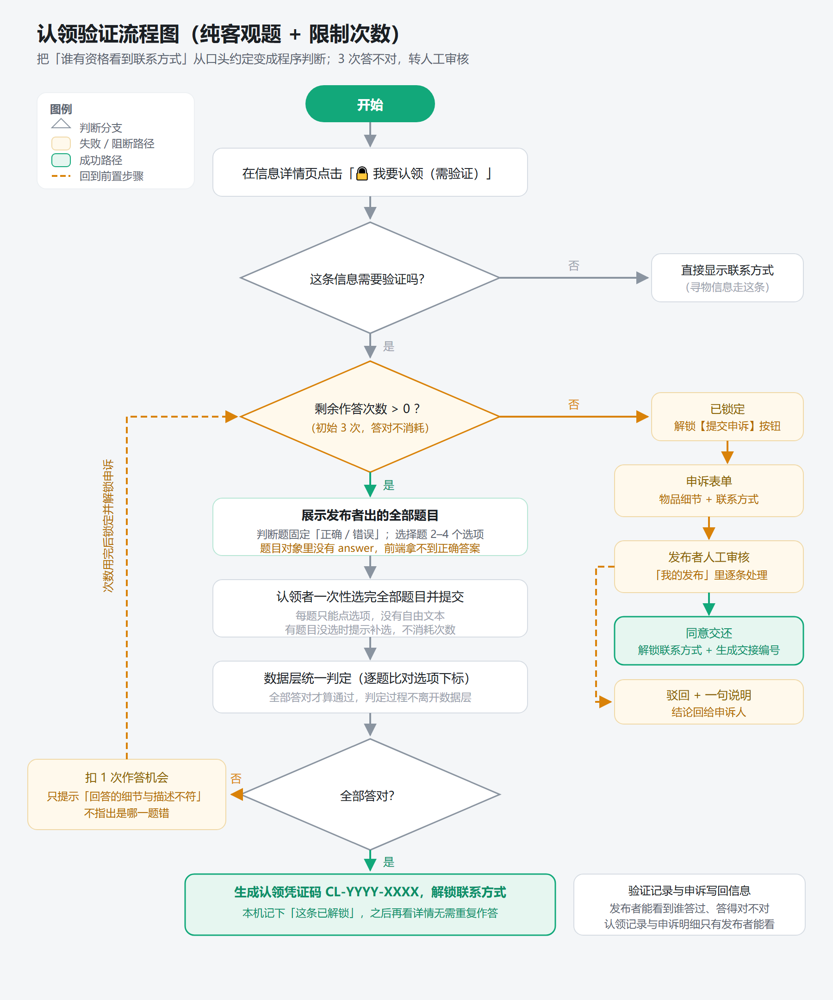

图里有四个地方是特意设计的：

- **题型只有判断和选择**：把"答对答错"变成下标比较，没有措辞歧义，也删掉了整块文本归一化逻辑（`U.normalizeAnswer()` 随之删除）；
- **一次性作答 + 统一判定**：提交一次就判全部题目，页面拿不到任何"哪题错"的信息，改前端也造不出来；
- **次数上限写进数据层**：`attemptsLeft` 存在信息上，扣减只发生在 `submitClaim()` 内部，绕过界面直接调数据层也躲不开；
- **3 次用完才解锁申诉**：`canAppeal` 由"剩余次数是否为 0"推导，认领页、结果页、详情页三处按钮都以它为准，不会出现"提前出现申诉入口"。

### 4.5 重要代码片段

#### 片段一：`publicQuestion()` / `toPublic()` —— 防冒领的第一道闸门

```js
// js/store.js
/**
 * 一道题的对外形态。
 * ★ 必须重新造对象：直接把内部题目交出去，answer 就跟着泄漏了。
 */
function publicQuestion(item) {
  return {
    id: item.id,
    type: item.type,
    typeName: LF.questionTypeOf(item.type).name,
    stem: item.stem,
    options: item.options.slice()
  };
}

LF.toPublic = function (post, options) {
  var opts = options || {};
  var out = {};
  var key;
  for (key in post) {
    if (Object.prototype.hasOwnProperty.call(post, key)) out[key] = post[key];
  }

  var questions = completeQuestions(post);
  out.questionCount = questions.length;
  out.questionMix = LF.questionMix(questions);
  out.questions = questions.map(publicQuestion);   // ← 只有题干和选项

  delete out.claims;      // 认领记录（谁选了什么）只给发布者
  delete out.appeals;     // 申诉明细（姓名、联系方式）更不外传
  delete out.pendingClaim;
  delete out.hidden;      // 旧版字段，迁移后不该再出现
  delete out.ownerId;     // 归属关系用 isOwner 表达，不直接把 uid 交给页面

  var isOwner = !!opts.viewerId && opts.viewerId === post.ownerId;
  out.isOwner = isOwner;
  out.needVerify = needsVerify(post);
  out.locked = out.needVerify && !isOwner && !opts.unlocked && !out.appealApproved;

  if (out.locked) {
    out.contactWay = '';     // 未解锁：联系方式根本不进页面
  }
  // 发布人姓名对非发布者一律打码，页面上显示成"张**"
  out.contactName = isOwner ? post.contactName : maskName(post.contactName);

  /* ... 后面还会补上 statusLabel、thumb、claimCount、attemptsLeft 等展示字段 ... */
  return out;
};
```

**为什么这样写：** 注意这里是 `delete out.claims` / `delete out.appeals`，而不是"界面上不显示"。区别很关键——如果只是前端 `display:none`，答案、认领记录、申诉人的联系方式仍然在内存对象里，打开控制台就能看到。**把它们从数据里删掉，才是真的拿不到。**

姓名打码同理：`contactName` 对非发布者返回 `张**`，完整姓名只给发布者本人。

这几条规则有专门的测试用例直接验证：

```js
it('题目对外只有题干和选项，没有 answer', function () {
  var view = store.get(post.id, OTHER);
  view.questions.forEach(function (question) {
    assert.notProperty(question, 'answer', '正确答案的下标绝不能下发');
  });
  assert.notInclude(JSON.stringify(view), 'answer');
});

it('公开视图里根本没有 hidden / claims / appeals 字段', function () {
  var view = store.get(post.id, OTHER);
  assert.notProperty(view, 'hidden');
  assert.notProperty(view, 'claims', '认领记录属于发布者，不能随信息公开');
  assert.notProperty(view, 'appeals', '申诉人的联系方式更不能公开');
});
```

#### 片段二：统一判定 —— 只回"通过 / 不通过"，不回"哪题错"

```js
// js/store.js — submitClaim 的核心
var questions = completeQuestions(post);
var answerMap = toAnswerMap(answers);            // { 题目id: 选项下标 }
var left = attemptsLeftOf(post);

var unanswered = questions.filter(function (question) {
  return !isChosen(answerMap[question.id], question.options.length);
});
if (unanswered.length) {
  return { ok: false, message: '还有 ' + unanswered.length + ' 道题没有作答' };
}

var correctCount = 0;
var record = { at: now(), passed: false, answers: questions.map(function (question) {
  var choice = Number(answerMap[question.id]);
  var correct = choice === Number(question.answer);
  if (correct) correctCount++;
  return { id: question.id, type: question.type, stem: question.stem,
           choice: choice, choiceText: question.options[choice], correct: correct };
})};

var passed = correctCount === questions.length;
record.passed = passed;

if (!passed) {
  // ★ 只回一句统一提示，绝不回传"哪一题错了"
  return {
    ok: true, passed: false, remaining: left - 1, maxAttempts: LF.VERIFY.maxAttempts,
    locked: left - 1 <= 0, canAppeal: left - 1 <= 0,
    message: '回答的细节与描述不符'
  };
}
```

**两个刻意的取舍：**

1. **判定是"全部答对"，而且不告诉认领者错在哪一题。** 第一版为了让失主知道错在哪，必须回传 `failed: [{ q, input }]`；这一版把它彻底删掉了——一旦告诉了他，3 次机会就变成"每次排除一题"的试探过程。代价是失主可能觉得"为什么不说清楚"，所以结果页把理由写明了（"否则反复试几次就能把答案试出来"），并给出申诉出口。记录里的 `correct` 字段只在 `listClaims()` 里返回，而那个接口有发布者校验。

2. **比对不再需要文本归一化。** 第一版有一套 `U.normalizeAnswer()`（去空格、全角转半角、忽略标点）来兜住「王小明 / 王 小明 / 王小明。」的差异。改成客观题之后，比对的对象是两个整数下标，这块逻辑连同它的映射规则一起删掉了——**少一个能出错的规则，就少一类误判**。而"为了比较而做的归一化"和"为了保存而做的清理"必须分开这条经验，仍然保留在搜索模块里（`U.normalizeText()` 只用于搜索匹配，`U.clean()` 才用于存储）。

#### 片段三：搜索 —— 一个纯函数

```js
// js/store.js
LF.matchKeyword = function (post, keyword) {
  var terms = U.normalizeText(keyword).split(' ').filter(function (t) { return t !== ''; });
  if (!terms.length) return true;

  var haystack = U.normalizeText([
    post.title,
    post.description,
    post.location,
    LF.categoryOf(post.category).name,
    LF.areaOf(post.area).name,
    LF.typeOf(post.type).name,
    maskName(post.contactName)
  ].concat(featureValues(post)).join(' '));   // 公开特征的值也要能搜到

  for (var i = 0; i < terms.length; i++) {
    if (haystack.indexOf(terms[i]) === -1) return false;
  }
  return true;
};
```

**几个考虑：**

- **用 `indexOf` 而不是正则。** 用户输入什么就搜什么，如果拼进 `new RegExp` 解析，输入一个 `(` 就会让整个页面崩掉。
- **多关键词按「与」处理。** 搜「耳机 图书馆」只返回同时在标题/描述/地点里提到这两者的信息。
- **搜索范围包含分类名和地点名。** 所以搜「证件卡片」能找到标题写「校园卡」的信息，搜「食堂」能找到地点写「第二食堂门口」的信息。
- **归一化里加了 NFKC 和零宽字符过滤。** 从微信、QQ 里复制过来的文字经常夹着看不见的零宽字符，人眼看着一样但字符串比较不相等。

#### 片段四：存储降级链

```js
// js/store.js
LF.createBrowserAdapter = function () {
  var memory = LF.createMemoryAdapter();

  var local = probeStorage(function () { return root.localStorage; });
  if (local) return wrapStorage(local, 'localStorage', true, memory);

  var session = probeStorage(function () { return root.sessionStorage; });
  if (session) {
    var wrapped = wrapStorage(session, 'sessionStorage', false, memory);
    wrapped.reason = '浏览器禁用了本地存储，已临时改用会话存储，关闭标签页后数据会丢失';
    return wrapped;
  }

  memory.reason = '浏览器禁用了本地存储，数据仅在当前页面有效';
  return memory;
};
```

```js
function probeStorage(getStorage) {
  var storage = null;
  try { storage = getStorage(); } catch (e) { return null; }
  if (!storage) return null;
  try {
    var key = '__lf_probe__';
    storage.setItem(key, '1');
    if (storage.getItem(key) !== '1') return null;
    storage.removeItem(key);
    return storage;
  } catch (e) { return null; }
}
```

**为什么中间要夹一层 sessionStorage：** 这是个多页应用，每跳一次页面，内存里的变量全部重置。如果 localStorage 不可用就直接退回内存，「发布 → 跳成功页」这一步数据就没了，主流程当场断掉。sessionStorage 至少能让同一标签页内把流程走完——**降级的目标是"功能仍然可用"，不是"程序不崩"这么低的标准。**

页面顶部会同步出现一条提示条，明确告诉用户当前数据的保留范围，而不是让他在毫不知情的情况下丢数据。

---

## 五、附加特点设计与展示

### 5.1 创意独到之处及意义

**核心特点：客观题认领验证 + 限制次数 + 人工审核兜底，把"谁有资格看到联系方式"从口头约定变成程序判断。**

意义在哪里？我们回看第一次作业梳理的痛点：信息分散、易被淹没、查不到进度。但真正下手做的时候发现还有一个更尖锐的问题：

> **招领信息挂出去，联系方式给谁？**

- 全公开 → 任何人都能看到，**冒领几乎没有成本**。真失主还没看到消息，东西可能就被别人领走了；
- 完全不公开 → 失主联系不上拾得者，信息等于白挂。

这是个两难。我们的解法是引入一个**只有物主能通过的门槛**：拾到东西的人出几道只有物主答得对的客观题，认领人全部答对才解锁联系方式。

这个设计的价值有三层：

1. **对拾得者**：敢把信息挂出来了，因为不怕被冒领；
2. **对失主**：能证明"这东西确实是我的"，反而更容易拿回来；
3. **对平台**：信息可信度提高，别人也愿意用。

而且它顺带解决了一个隐私问题：**发布者的联系方式默认不公开**，只有通过验证的人能看到，减少了联系方式被爬走的风险。

另外三个附加特点（任务书里点名提到的那两类我们都做了）：

| 特点 | 说明 |
| --- | --- |
| **一键复制联系方式** | 详情页和验证通过页都有，点一下进剪贴板。复制失败时不是只弹句错误就完了，会自动弹出可手动复制的输入框，事情还能办成 |
| **按物品分类 / 地点筛选** | 首页支持分类、地点、状态三个维度的筛选，选项右侧实时显示条数；桌面用左侧栏，手机用图标条 + 下拉 |
| **搜索历史 + 热门搜索** | 最近 10 条历史，去重、可单条删除、可一键清空；热门词由真实数据统计得出，不是写死的 |

还有一个不在清单里、但我们觉得挺有用的细节：**首次打开自动灌入一批演示数据，其中两条归属于使用者本人**。这样点进「我的发布」不是一片空白，可以立刻演示"标记已归还""查看认领申请"这些需要发布者身份才能用的功能。

### 5.2 实现思路

**认领验证的数据结构：**

```js
{
  id: 'found_xxx',
  type: 'found',
  questions: [                               // ★ answer 永远不出现在公开视图里
    { id: 'q1', type: 'judge',  stem: '卡面上写的是王小明这个名字',
      options: ['正确', '错误'], answer: 0 },
    { id: 'q2', type: 'choice', stem: '卡号后四位是',
      options: ['3882', '1027', '5566'], answer: 0 },
    { id: 'q3', type: 'choice', stem: '这张卡属于哪个年级',
      options: ['2023 级', '2022 级'], answer: 1 }
  ],
  claims: [                                  // 收到的认领记录（只有发布者能看）
    { at: 1759..., passed: true,  voucher: 'CL-2026-3882', answers: [...] },
    { at: 1759..., passed: false, answers: [...] }
  ],
  appeals: [                                 // 3 次全败后的人工审核申请（明细只有发布者能看）
    { id: 'appeal_xxx', claimantId: 'me_xxx', name: '李思远',
      contact: '微信：lisiyuan2022', detail: '卡号后四位 3882，卡套里还有一张借书凭条……',
      decision: 'pending', note: '', voucher: '', decidedAt: null }
  ],
  attemptsLeft: 2
}
```

**四个关键设计点：**

1. **题目和答案存在一起，但下发的对象里没有答案。** `toPublic()` 用 `publicQuestion()` 重新造一份只含 `{ id, type, typeName, stem, options }` 的题目数组；`answer` 只活在两个地方：数据层内部判定时，以及发布者编辑时的 `getEditable()`。

2. **题型只有判断题和选择题，且结构由数据层兜底。** 判断题的选项固定为「正确 / 错误」（发布者传什么都不算数）；选择题里的空选项行会被丢掉、正确答案下标跟着重排，所以前端多传一行空选项也不会把答案对错位。

3. **申诉是一次落库的表单，不是一句弹窗文案。** 只做一个"请线下联系发布者"的弹窗最省事，但发布者就没有可判断的凭据；所以申诉内容（称呼、联系方式、物品细节）存在信息上，发布者在「我的发布 → 人工审核」里逐条处理：同意交还即解锁联系方式并生成线下交接编号，驳回则附一句理由回给申诉人。

4. **申诉的解锁条件是"剩余次数为 0"。** `canAppeal` 由 `attemptsLeft <= 0` 推导（见 `js/store.js` 的 `toPublic()`），认领页、结果页、详情页三处按钮都以它为准，不存在"次数没用完就出现申诉入口"的路径。

### 5.3 代码片段

**出题：把题目的结构固定下来**

```js
// js/config.js — 题型与规则
LF.QUESTION_TYPES = [
  { key: 'judge',  name: '判断题', hint: '系统固定给出「正确 / 错误」两个选项' },
  { key: 'choice', name: '选择题', hint: '自己写 2–4 个选项，并指定正确答案' }
];

LF.VERIFY = {
  minQuestions: 3,        // 至少出几题
  maxQuestions: 5,        // 最多出几题
  suggestedQuestions: 4,  // 建议题量（界面上按这个提示）
  maxAttempts: 3,         // 认领者最多答几次，用完才解锁【申诉】
  minOptions: 2,
  maxOptions: 4
};
```

```js
// js/store.js — normalizeQuestions：把前端传来的题目整理成规范结构
if (type === 'judge') {
  options = LF.JUDGE_OPTIONS.slice();          // ['正确', '错误']
  answer = Number(raw.answer) === 1 ? 1 : 0;
} else {
  // 丢掉空选项行，并把正确答案的下标重新映射
  var wanted = Number(raw.answer);
  options = [];
  answer = -1;
  for (var j = 0; j < rawOptions.length; j++) {
    var text = U.clean(rawOptions[j]);
    if (text === '') continue;
    if (j === wanted) answer = options.length;
    options.push(text);
  }
}
```

**为什么由数据层重排下标：** 界面上"删除一个选项""切换题型"都会改动选项数组，如果直接在页面上算正确答案的下标，很容易出现"看着选的是第 2 项，存进去却指到第 3 项"。把重排规则放在数据层并配单元测试（`选择题里的空选项行会被丢掉，正确答案下标跟着重排`），这类错位就只有一个地方可能出错。

**统一判定：把"哪题错了"彻底留在数据层**

```js
// js/store.js — submitClaim（省略了前后校验）
var questions = completeQuestions(post);
var answerMap = toAnswerMap(answers);
var unanswered = questions.filter(function (question) {
  return !isChosen(answerMap[question.id], question.options.length);
});
if (unanswered.length) {
  return { ok: false, message: '还有 ' + unanswered.length + ' 道题没有作答' };
}

var correctCount = 0;
var record = { at: now(), passed: false, answers: questions.map(function (question) {
  var choice = Number(answerMap[question.id]);
  var correct = choice === Number(question.answer);
  if (correct) correctCount++;
  return { id: question.id, type: question.type, stem: question.stem,
           choice: choice, choiceText: question.options[choice], correct: correct };
})};

var passed = correctCount === questions.length;
record.passed = passed;
```

**两点说明：**

- 记录里**带上了每题的对错**，但它只从 `listClaims()` 返回，而那个方法做了发布者校验——发布者看到的才是完整明细；认领者拿到的失败结果里连 `failed` 字段都没有；
- 失败结果统一是 `{ ok: true, passed: false, remaining, canAppeal, locked, message: '回答的细节与描述不符' }`。测试里直接断言"**全错和只错一题返回的对象结构完全一样**"，防止哪天有人顺手把错题信息加回去。

**时间的可注入性：把不确定性关进盒子里**

```js
LF.createStore = function (storage, options) {
  var opts = options || {};
  function now() {
    return opts.now ? U.parseTime(opts.now).getTime() : Date.now();
  }
  // ...
};
```

**为什么这么做：** 时间相关的逻辑（"这条信息挂了多久该提醒"）必须能在测试里固定，否则测试会间歇性地红。第一版还额外注入了随机源（因为要随机抽题），改成"一次答完全部题目"之后，随机性从这条链路里彻底消失，注入的参数也就只剩 `now`——**能删掉的不确定性就别留着**。

```js
var store = T.makeStore();   // 夹具里把 now 固定成 2026-10-02T10:00:00
```

涉及"3 次失败后锁定"的用例，就老老实实失败三次再断言，而不是想办法"快进"：

```js
it('连续答错 3 次后锁定，并且解锁申诉', function () {
  var ctx = makeVerifyStore();
  var first = ctx.store.submitClaim(ctx.post.id, T.answers(['q1']));
  assert.isFalse(first.canAppeal, '第 1 次失败还不该解锁申诉');

  ctx.store.submitClaim(ctx.post.id, T.answers(['q2']));
  var third = ctx.store.submitClaim(ctx.post.id, T.answers(['q3']));

  assert.isTrue(third.locked);
  assert.isTrue(third.canAppeal, '第 3 次失败后才解锁申诉');
  assert.strictEqual(third.remaining, 0);
});
```

**状态流转：把"重复点也没事"做进数据层**

```js
// js/store.js — markDone
store.markDone = function (id, actor) {
  var post = findPost(id);
  if (!post) return { ok: false, errors: { _: '这条信息不存在或已被删除' } };
  if (!actor || post.ownerId !== actor) {
    return { ok: false, errors: { _: '只有发布者本人可以更新状态' } };
  }
  if (post.status === 'done') {
    return { ok: true, post: LF.toPublic(post, { viewerId: actor, unlocked: true }), unchanged: true };
  }
  return store.update(id, {
    status: 'done',
    doneType: LF.DONE_TYPES[post.type].key,
    doneAt: now()
  }, actor);
};
```

"标记"这个动作天然可能被点两次（手抖、网络卡了重试）。这里把它做成**幂等**的：第二次调用返回 `unchanged: true`，并且**不改动原有的完成时间**——否则"已归还于今天"会变成"已归还于刚才"，记录就不准了。

### 5.4 实现成果展示

**桌面端首页**：左侧筛选栏（分类 / 地点 / 状态，各选项带实时条数），右侧卡片网格，卡片直接标出寻物/招领与当前状态。

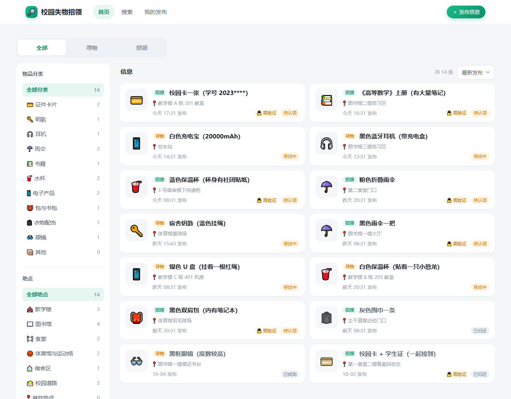

**搜索结果**：关键词命中标题、描述、地点、分类名；多关键词按「与」匹配。

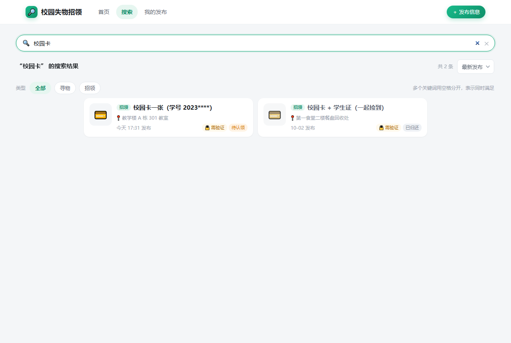

**详情页（未通过验证）**：发布人姓名打码，联系方式显示为「通过认领验证后可见」，下方说明"出了几道验证题、最多答 3 次、3 次没过可以申诉"。

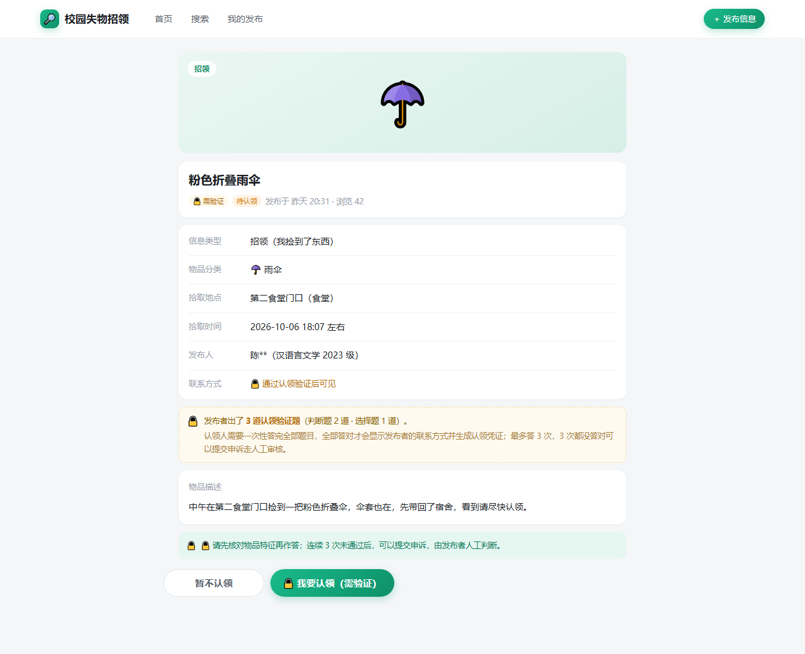

**发布页（含出题编辑器）**：寻物与招领共用一套表单；招领额外有出题区，可以加判断题 / 选择题、切换题型、增删选项并指定正确答案，也能按物品分类插入常用模板。

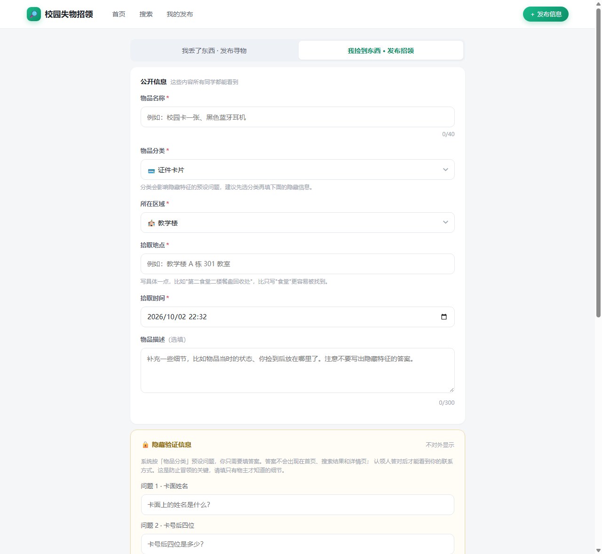

**我的发布**：状态维护入口、验证题数与认领 / 人工审核统计、本地数据管理。

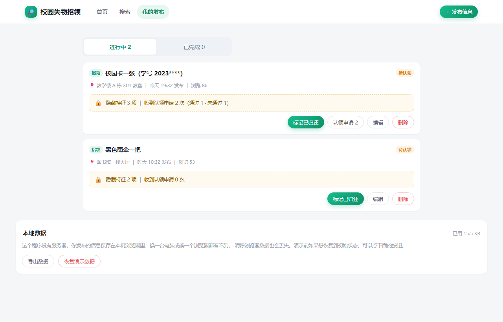

**认领验证（答题页）**：一次性看到全部题目——判断题点「正确 / 错误」，选择题点选项；顶部显示剩余作答次数，底部实时提示还差几题没选。

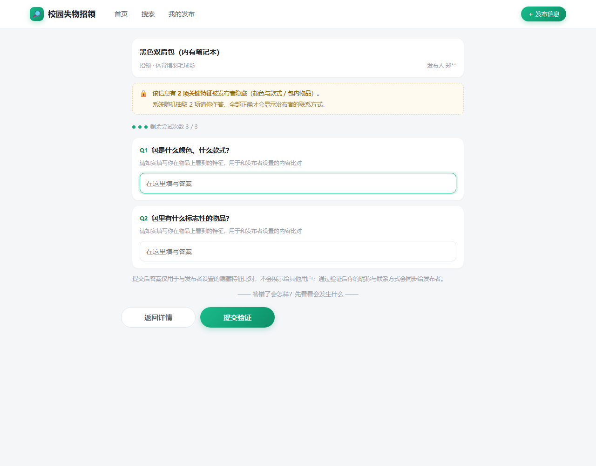

**验证通过**：生成认领凭证码，解锁联系方式，可一键复制。

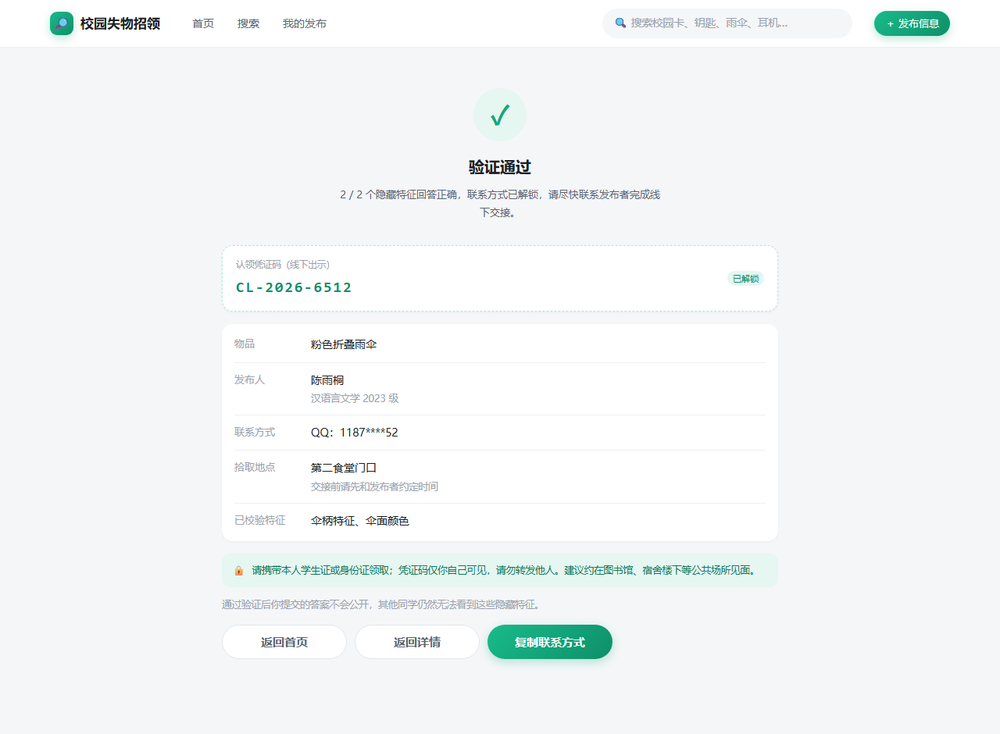

**验证未通过**：只提示「回答的细节与描述不符」与剩余次数——**不显示是哪一题错**。

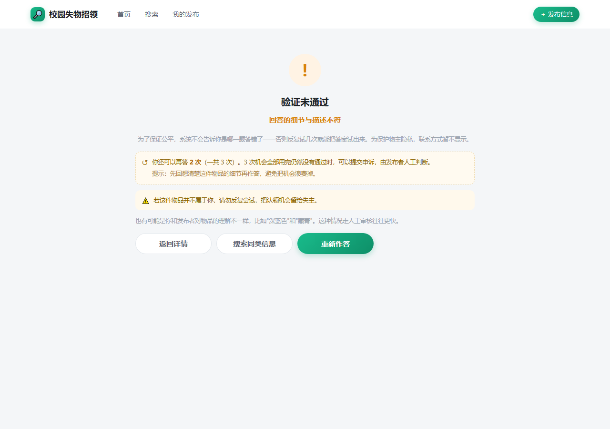

**3 次用完**：此时才解锁【提交申诉】，进入人工审核通道。

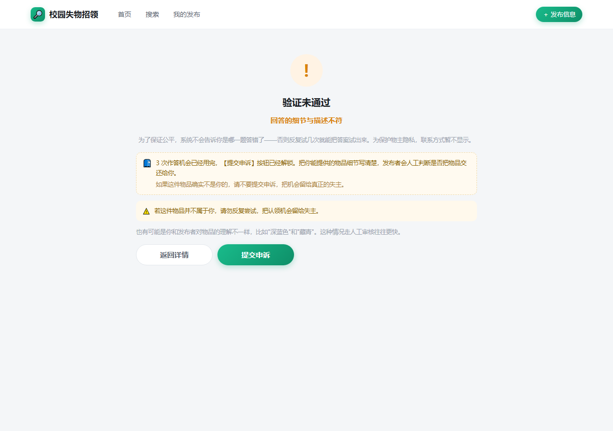

**申诉（人工审核通道）**：认领者填写的申诉表单与处理进度，以及发布者在「我的发布」里逐条处理的入口。

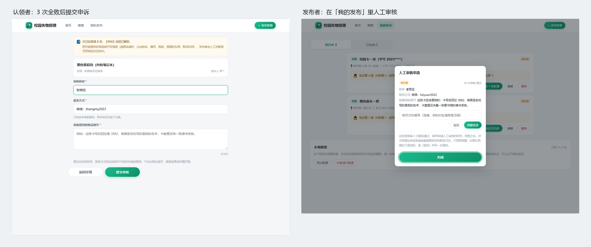

**手机端（宽屏拉窄自动切换）**：

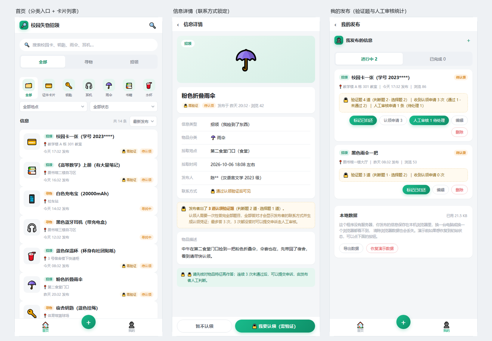

**单元测试报告**：

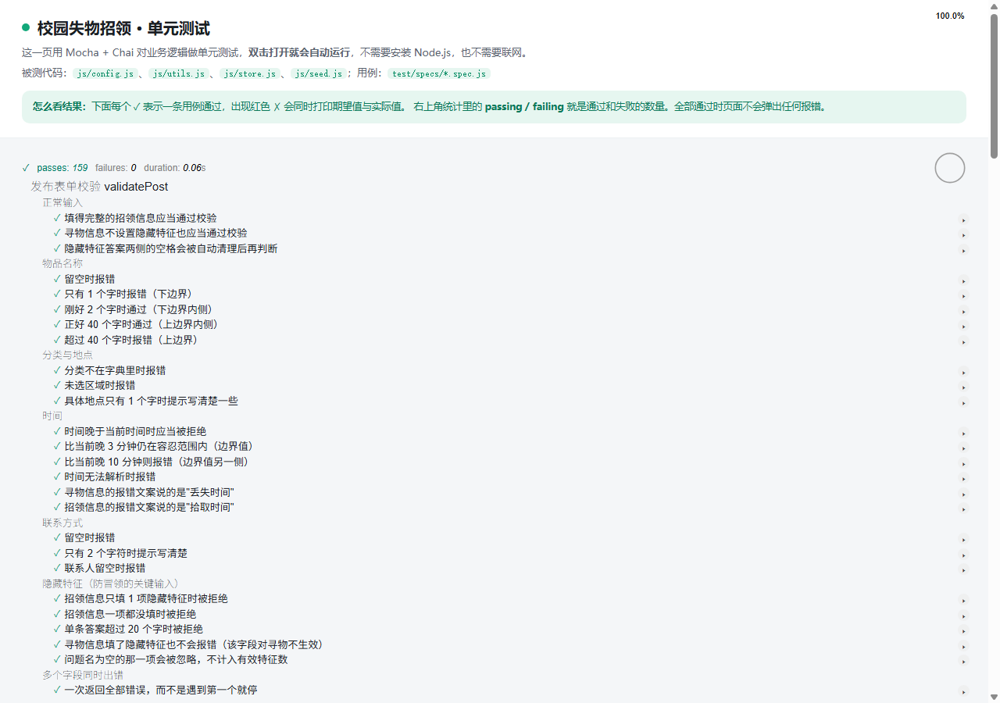

---

## 六、目录说明和使用说明

> 完整版见仓库 `README.md` 与 `docs/目录说明与使用说明.md`，这里给出要点。

### 6.1 目录是怎么组织的

按「页面 → 样式 → 逻辑 → 测试 → 文档」五层分开，核心思路是**页面文件只管结构，业务规则全部收在数据层**：

```
校园失物招领Web/
├── ① 页面层：9 个 HTML，文件名即用途
│   index / search / detail / publish / success / mine / verify / verify-result / appeal
├── ② 样式层：3 个 CSS
│   css/tokens.css      设计令牌（色板、圆角、阴影、字号）
│   css/components.css  通用组件（卡片、标签、按钮、表单、题目编辑器、弹层、空状态）
│   css/layout.css      响应式布局（900px 断点）
├── ③ 逻辑层
│   js/config.js        业务字典（类型、分类与搜索引导、地点、出题模板、验证规则）
│   js/utils.js         纯函数工具（时间、文本归一化、图片压缩、剪贴板）
│   js/store.js     ★   数据层：全部业务规则（含申诉通道与旧数据迁移）
│   js/seed.js          演示数据（招领信息自带 3–4 道客观题）
│   js/ui.js            界面公共层（导航外壳、卡片渲染、轻提示、弹窗、人工审核弹窗）
│   js/page-*.js        9 个页面的控制器，与 HTML 一一对应
├── ④ 测试层
│   test/test.html      测试入口，双击即跑
│   test/specs/*.spec.js 用例（7 个文件，262 个用例）
│   test/lib/           Mocha 与 Chai 浏览器构建（随仓库提交）
└── ⑤ 文档层
    docs/               目录说明、PSP、博客草稿、流程图与截图
```

**命名约定：**

- 页面：小写、多词用连字符（`verify-result.html`）；
- 脚本：`page-xxx.js` 一定是某个 HTML 的控制器，与页面同名，一眼能对上；不带 `page-` 前缀的是被复用的公共模块；
- 数据字段：一律小驼峰，语义直白（`happenedAt`、`contactWay`、`doneType`）；字典类字段存 `key` 而不是中文，中文只出现在 `config.js` 里。

### 6.2 测试人员如何运行

1. 把 `校园失物招领Web` 文件夹整个下载到本地；
2. **用谷歌浏览器打开根目录下的 `index.html`**（双击即可）。

不需要安装任何东西，不需要起服务器，不需要联网。第一次打开会自动灌入演示数据。

**运行单元测试**：双击 `test/test.html`，用 Chrome 打开，自动跑完全部 262 个用例。

> **务必用 Chrome。** `file://` 协议下不同浏览器对本地存储的处理不一样：Chrome 把所有本地文件视为同一来源，页面之间能共享数据；Firefox 会把每个文件当成独立来源，导致「发布成功后跳到成功页，数据却读不到」。本次作业统一指定 Chrome。

**建议的验收路线**（走一遍就覆盖了全部核心功能）：

| 步骤 | 操作 | 应该看到 |
| --- | --- | --- |
| 1 | 首页点分类图标、切换寻物/招领 | 列表随之筛选，标题与条数同步变化；选中分类后出现一条搜索引导，写明这一类只公开哪几项特征、该按什么搜｜选「其他」时换成"翻列表、按地点找" |
| 2 | 搜索「校园卡」 | 出现结果；搜不到时给出空状态和下一步建议 |
| 3 | 打开一条「其他」类的招领信息（演示数据 `seed_6`《高等数学》） | 详情页写着这一类是**信任原则**：没有验证题，描述、照片和联系方式都直接可见 |
| 4 | 打开一条带 🔒 需验证的招领信息 | 联系方式显示「通过认领验证后可见」；题目只有题干和选项，看不到正确答案 |
| 5 | 点「我要认领」，**一次选完全部题目但故意选错一题** | 跳到「验证未通过」，只提示「回答的细节与描述不符」与剩余次数，**不显示哪题错** |
| 6 | 再答一次，这次全部选对 | 跳到「验证通过」，给出凭证码与解锁的联系方式 |
| 7 | 点「＋ 发布信息」，类型选「招领」、分类选「其他」 | 出题区消失，换成一段说明：这一类不出验证题、描述会直接公开、代价是没有防冒领闸门 |
| 8 | 同一页把分类改成「电子产品」 | 出题区立刻回来，可加判断题 / 选择题、切题型、指定正确答案；题数不足 3 题时字段标红 |
| 9 | 发布成功 →「查看我的发布」 | 新信息出现在「进行中」，并显示「验证题 N 道」；「其他」类的条目则显示"不设认领验证题" |
| 10 | 点「标记已归还」并确认 | 条目移到「已完成」；回首页看到它变成「已归还」 |
| 11 | 找一条已经答满 3 次的信息（演示数据 `seed_mine_1` 已经答满） | 详情页底部按钮变成「📮 提交申诉（人工审核）」 |
| 12 | 填申诉表并提交 → 回「我的发布」点「人工审核 1 待处理」 | 看到对方写的细节与联系方式，点「同意交还」后对方即可看到你的联系方式 |

**想知道某条演示信息的正确答案**：在「我的发布」里点它的「编辑」，题目编辑器里被圆点选中的那一项就是正确答案（`seed_mine_1` 的四道题答案依次是：正确、正确、3882、2023 级）。

**演示前想恢复初始状态**：在「我的发布」页底部「本地数据」区域点「恢复演示数据」。

**演示前想恢复初始状态**：在「我的发布」页底部「本地数据」区域点「恢复演示数据」。

---

## 七、单元测试

### 7.1 选用的测试工具与学习过程

**选用 Mocha + Chai。**

学习路径是这样的：先看了任务书附录里推荐的几篇（廖雪峰的 JavaScript 教程、阮一峰的 Mocha 实例教程），照着把官方文档的 Getting Started 跑了一遍，理解了 `describe / it / beforeEach` 这套 BDD 风格的组织方式，然后决定用它。

**遇到的第一个问题不是怎么写测试，而是"在哪跑"。** 按常规做法是 `npm install mocha`，在 Node 里跑——但这个项目本身不需要 Node，如果为了跑测试让助教先装 Node，就违背了"下载后双击就能用"的底线。

于是改成**把 Mocha 的浏览器版构建随仓库一起提交**，测试页用 `<script>` 标签直接加载：

```html
<script src="lib/mocha.js"></script>
<script src="lib/chai.js"></script>
<script>mocha.setup({ ui: 'bdd', timeout: 5000, slow: 100 });</script>
<script src="../js/store.js"></script>
<script src="specs/verify.spec.js"></script>
<script>
  var runner = mocha.run();
  runner.on('end', function () {
    var stats = runner.stats;
    document.documentElement.setAttribute('data-selftest',
      (stats.failures ? 'FAIL' : 'PASS') + '|passing=' + stats.passes + '|failing=' + stats.failures);
  });
</script>
```

这样双击 `test/test.html` 就能跑，离线可用。

**一个版本上的坑**：Chai 从 5.x 起只提供 ES Module，普通 `<script>` 加载会报 `SyntaxError: Unexpected token 'export'`，而 `file://` 下又不能用 `type="module"`（会被 CORS 拦）。所以 Chai 固定在 **4.5.0**——最后一个带 UMD 浏览器构建的版本。仓库里 `test/lib/_fetch-libs.py` 记录了这两个库的来源和版本，需要时可以重新下载。

### 7.2 一份简易教程：从零开始给这个项目加一条测试

**第一步：想清楚要测什么。** 不是"测这个函数"，而是"什么情况会出错"。比如发布表单，要测的不是 `validatePost` 能返回结果，而是"漏填物品名称时会不会拦住"。

**第二步：造一份必然合法的输入作为基准。**

```js
// test/specs/helpers.js
/** 一套标准验证题：判断题 2 道 + 选择题 2 道，正确答案一律是第 1 个选项。 */
function questions() {
  return [
    { id: 'q1', type: 'judge',  stem: '卡面上写的是王小明这个名字', answer: 0 },
    { id: 'q2', type: 'judge',  stem: '卡面贴着一张蓝色小熊贴纸', answer: 0 },
    { id: 'q3', type: 'choice', stem: '卡号后四位是', options: ['3882', '1027', '5566'], answer: 0 },
    { id: 'q4', type: 'choice', stem: '这张卡属于哪个年级', options: ['2023 级', '2022 级'], answer: 0 }
  ];
}

/** 一份作答：不传参数表示全对，传 ['q3'] 表示第 3 题故意答错。 */
function answers(wrongIds) {
  var wrong = wrongIds || [];
  return questions().map(function (question) {
    return { id: question.id, choice: wrong.indexOf(question.id) === -1 ? 0 : 1 };
  });
}

function validFound(overrides) {
  var base = {
    type: 'found',
    title: '校园卡一张',
    category: 'card',
    area: 'teaching',
    location: '教学楼 A 栋 301 教室',
    happenedAt: new Date('2026-10-02T09:00:00'),
    /* ... */
    questions: questions()
  };
  return merge(base, overrides);
}
```

**第三步：每次只改一个字段，测它的边界。**

```js
it('只有 1 个字时报错（下边界）', function () {
  var result = LF.validatePost(T.validFound({ title: '卡' }), opts);
  assert.property(result.errors, 'title');
});

it('刚好 2 个字时通过（下边界内侧）', function () {
  var result = LF.validatePost(T.validFound({ title: '校园' }), opts);
  assert.notProperty(result.errors, 'title');
});
```

**第四步：把当前时间固定下来。** 这一步很重要，前面代码片段里已经说过——不固定 `now`，涉及"相对时间显示""挂了多久该提醒"的断言会随运行时刻改变，测试就会间歇性地红。（第一版还要固定随机源，因为那时是随机抽题；改成"一次答完全部题目"之后，随机性从这条链路里消失，注入的参数只剩 `now`。）

**第五步：用内存存储隔离每个用例。**

```js
function makeStore(options) {
  var adapter = opts.adapter || LF.createMemoryAdapter();
  var store = LF.createStore(adapter, storeOpts);
  store.init(opts.seed || []);
  return store;
}
```

每个 `it` 里都新建一个 store，用例之间互不污染，也不用担心测试数据残留。

### 7.3 测试代码展示

一共 **7 个测试文件、262 个用例**，按被测模块划分：

| 文件 | 测试对象 | 用例数 | 重点 |
| --- | --- | --- | --- |
| `validate.spec.js` | `LF.validatePost` | 77 | 每个字段的上下边界、出题规则（题量 3–5、选项 2–4、必须指定正确答案、选项之间要差别明显）、公开特征必填与取值合法性、卡号打码位数、\"出题禁区\"不变式、搜索引导语与特征字典的一致性、「其他」类不出验证题、老记录的状态流转 |
| `query.spec.js` | `matchKeyword` / `queryPosts` / 搜索历史 | 57 | 命中与不命中成对写、排序、多关键词、公开特征的搜索与筛选、打码卡号的通配搜索（位数一致 + 双向 `*`） |
| `privacy.spec.js` | `toPublic` / `markDone` / 权限 | 36 | 正确答案不外泄、认领记录与申诉不外泄、状态流转、越权拦截 |
| `verify.spec.js` | `startClaim` / `submitClaim` | 32 | 一次性取题、统一判定、次数与申诉解锁、换题重算次数、「其他」类不开放认领入口 |
| `appeal.spec.js` | `submitAppeal` / `listAppeals` / `resolveAppeal` / 迁移 | 28 | 解锁条件、表单校验、发布者处理、申诉隐私、v1 → v2 迁移 |
| `storage.spec.js` | 适配器与容错 | 27 | 脏数据、配额错误、首次灌数据、演示数据的公开特征完整性 |
| `e2e.spec.js` | 主流程串联 | 5 | 模块拼起来也是通的（含"3 次全败 → 申诉 → 同意交还"链路） |
| **合计** | | **262** | |

这里贴两段最能说明问题的：

**① 统一判定：全错和只错一题，返回给前端的东西必须一模一样**

```js
it('全错与只错一题的返回结构完全一样（不给排除法留线索）', function () {
  var ctx = makeVerifyStore();
  var first = ctx.store.submitClaim(ctx.post.id, T.answers(['q3']));                     // 只错一题
  var second = ctx.store.submitClaim(ctx.post.id, T.answers(['q1', 'q2', 'q3', 'q4']));  // 全错

  assert.deepEqual(Object.keys(first).sort(), Object.keys(second).sort());
  assert.strictEqual(first.message, second.message);
  assert.strictEqual(first.passed, second.passed);
  assert.strictEqual(second.remaining, first.remaining - 1);
});

it('答错一题就不通过，而且不告诉你是哪一题错', function () {
  var ctx = makeVerifyStore();
  var result = ctx.store.submitClaim(ctx.post.id, T.answers(['q3']));

  assert.isFalse(result.passed);
  assert.strictEqual(result.message, '回答的细节与描述不符');
  assert.notProperty(result, 'failed');
  // 连题号都不能出现，否则前端能反推出错在哪一题
  assert.notInclude(JSON.stringify(result), 'q3');
});
```

**为什么费劲去断言"结构一样"：** 因为这是本次改版的核心承诺。如果哪天有人为了"提升体验"把 `failed` 加回来，这条用例会立刻变红——**把设计决策写成测试，它才不会被后续改动悄悄推翻。**

**② 端到端串联：模块拼起来也是通的**

```js
it('完整走一遍"捡到校园卡 → 发布招领并出题 → 失主搜到 → 答对全部题目 → 拿到联系方式 → 标记已归还"', function () {
  var store = T.makeStore();

  // 1. 发布招领，并自己出 4 道客观题
  var created = store.create(T.validFound({ /* ... */ }), OWNER);
  var postId = created.post.id;
  assert.strictEqual(created.post.questionCount, 4);

  // 2. 失主用关键词搜到
  var found = store.list({ keyword: '校园卡', viewerId: FINDER });
  assert.lengthOf(found, 1);

  // 3. 打开详情：看得到描述，看不到联系方式和正确答案
  var detail = store.get(postId, FINDER, true);
  assert.strictEqual(detail.views, 1);
  assert.isTrue(detail.locked);
  assert.notInclude(JSON.stringify(detail), '"answer"');

  // 4~6. 认领：先错一题扣一次，再全对解锁
  var wrong = store.submitClaim(postId, T.answers(['q3']));
  assert.isFalse(wrong.passed);
  assert.strictEqual(wrong.message, '回答的细节与描述不符');
  assert.strictEqual(wrong.remaining, LF.VERIFY.maxAttempts - 1);

  var right = store.submitClaim(postId, T.answers());
  assert.isTrue(right.passed);
  assert.match(right.voucher, /^CL-\d{4}-\d{4}$/);

  // 7. 之后再看详情可以直接看到联系方式
  assert.isFalse(store.get(postId, FINDER).locked);

  // 8~9. 标记已归还，别人在列表和搜索里都能看到
  var done = store.markDone(postId, OWNER);
  assert.strictEqual(done.post.statusLabel, '已归还');
  assert.strictEqual(T.byId(store.list({ keyword: '校园卡' }), postId).statusLabel, '已归还');
});
```

单模块测试都过、拼起来却出问题，是结对编程里很常见的情况——所以专门写了一个文件把主流程串一遍。

### 7.4 构造测试数据的思路

**思路一：等价类划分 + 边界值。**

每个字段都同时测"缺失/过短"和"超长"两侧，并且**卡在边界的两边各测一次**。比如物品名称限定 2–40 字，就测 1 字（应报错）、2 字（应通过）、40 字（应通过）、41 字（应报错）。

**思路二：每次只动一个变量。**

基准数据永远是一份"必然合法"的输入，每个用例只改其中一个字段。这样一旦失败，出错原因就是唯一的那个字段，不用排查。

**思路三：正例反例成对写。**

只测"应该通过"会写出过于宽松的实现，只测"应该拒绝"会写出过于严格的实现。搜索、答案比对、权限校验这三处全部是成对写的。

**思路四：把不确定性消灭掉。**

固定当前时间 `2026-10-02T10:00:00`。涉及"3 次失败后锁定"的用例，就老老实实失败三次再断言，而不是想办法"快进"；第一版还需要固定随机源（那时是随机抽题），改成"一次答完全部题目"之后，随机性从这条链路里消失，注入的参数只剩时间。

**如何考虑将来测试人员的刁难？**

我们自己先扮演了一遍"刁难的测试人员"，专门想了几类：

| 刁难思路 | 我们的应对（对应用例） |
| --- | --- |
| 前端藏起来了，数据里还在吧？ | 断言 `JSON.stringify(view)` 里搜不到 `answer`，并且断言 `claims` / `appeals` 根本不在公开对象里 |
| 前端传了 id 和浏览量，能覆盖原值吗？ | 恶意构造 `update(id, { id: '伪造', views: 9999, ownerId: '黑客' })`，断言这些字段不被篡改 |
| 别人能不能改我的信息？ | 用另一个 actor 调 `markDone` / `update` / `remove` / `listClaims` / `listAppeals`，断言全部被拒 |
| 从返回值里能看出哪题错了吗？ | 断言失败结果里没有 `failed` 字段、序列化后连题号都不出现，并且"全错"与"只错一题"的返回结构完全一致 |
| 次数没用完就想过申诉？ | 断言 `attemptsLeft > 0` 时 `submitAppeal` 被拒，只有答满 3 次才允许 |
| 一次不选完就提交？ | 断言返回"还有 N 道题没有作答"，且不消耗次数（`attemptsLeft` 不变） |
| 存储里塞坏数据会白屏吗？ | 写入非法 JSON、非数组、混入 `null` / 字符串 / 缺 id 的对象，断言页面仍能正常工作 |
| 存储写满会怎样？ | 用会抛 `QuotaExceededError` 的假适配器，断言返回的是**中文的可操作提示**而不是异常 |
| 搜索框输入 `(` 会不会崩？ | 用 `indexOf` 而不是正则，天然免疫 |
| 空关键词、纯空格、全角空格？ | 断言不过滤（返回全部）而不是返回空列表 |
| 旧版本的数据打开会不会崩？ | 造一条 v1 的「隐藏特征」数据，断言迁移后能正常显示、旧答案没有残留在数据里，并且重新出题后验证能重新生效 |

**为什么这么在意这些：** 因为这几类恰恰是"实现的时候最容易忽略、出问题后果又最严重"的地方。特别是第一条——如果 `toPublic` 哪天被改坏了，界面上看不出任何异常，但防冒领机制已经形同虚设。**给这种"坏了也看不出来"的逻辑配上测试，才是测试真正的价值。**

### 7.5 一个反面教材：测试全绿，但搜索框根本看不见

上面写了那么多测试思路，这里补一个我们自己的教训——**它说明自动化检查也有盲区。**

**背景**：做响应式时，我们给桌面布局加了一条 CSS，想把首页那个"搜索框样子"的入口链接藏起来（桌面端顶部导航栏里已经有搜索入口了）：

```css
@media (min-width: 900px) {
  .mobile-head, .filter-row, .cat-strip,
  .page .searchbox { display: none; }
}
```

**问题**：`search.html` 里真正的搜索输入框，用的**也是 `.searchbox` 这个类名**。于是桌面宽度下，整个搜索输入框被一起藏掉了——用户点进搜索页，看不到任何可以打字的框。

**为什么没被发现**：因为当时所有的自动检查都是"通过"的：

- 页面自检标记 `data-selftest` 显示 PASS —— 它检查的是"渲染过程没抛异常"，元素可不可见它不管；
- 输入法的交互测试也是"通过"的 —— 因为测试脚本是**直接按引用操作元素**的：

```js
var input = document.getElementById('searchInput');
input.value = '耳机 ';          // ← 对 display:none 的元素同样有效
input.dispatchEvent(new Event('input', { bubbles: true }));
```

  元素虽然不可见，但它在 DOM 里，赋值和派发事件照样工作。**测试跑得很欢，用户却一个字也打不进去。**

**怎么发现的**：换成测"这个元素能不能被点到"之后，一测就露馅了：

```js
var r = el.getBoundingClientRect();
console.log(r.width, r.height);              // 0 0 ← 根本没渲染
var top = document.elementFromPoint(cx, cy); // 该位置上最顶层的是谁
console.log(top === el);                     // false ← 被别的元素盖着
```

修复很简单（给首页那个入口换个类名 `.searchbox-entry`），但**教训比修复本身重要**：

1. **"页面没报错"和"用户能用"是两回事。** 自检只能证明程序没崩，证明不了功能可用。
2. **测试脚本按引用操作元素，会绕开真实用户遇到的障碍。** 真实的点击要经过布局、命中测试、焦点——用 `elementFromPoint` 和 `getBoundingClientRect` 才能模拟到这一层。
3. **所以自动化检查至少要有三层**：渲染有没有报错 → 关键元素是否可见可点 → 真实操作流程是否走得通。我们原来只做了第一层和第三层，中间那层恰好漏掉了这类问题。

补上可见性检查之后，两种布局、九个页面一次跑完，输出是这样：

```
===== 桌面 1280 =====
  search.html          #searchInput:OK ; #hotCloud button:OK
  publish.html         #fTitle:OK ; #submitBtn:OK
  ...
===== 手机 512 =====
  search.html          #searchInput:OK ; #hotCloud button:OK
  ...
```

哪一项变成"尺寸为0"或者"被 xxx 挡住"，就是又出现同类问题了。

---

## 八、GitHub 代码签入记录

> 【这一节请自行截图。建议截 `git log --oneline --graph` 的输出，或者 GitHub 仓库的 Commits 页面。
> 注意：题目说明里写了「签入记录不合理的项目会被助教抽查询问项目细节」，所以**不要一次性把所有代码提交上去**，按功能分批提交，提交信息写清楚做了什么。】

建议的提交粒度（按功能划分，每完成一个功能提交一次）：

```
feat: 项目骨架与设计令牌、响应式布局
feat(config): 业务字典——分类、地点、题型与出题模板
feat(store): 数据层——校验、搜索筛选、状态流转、权限
feat(store): 认领验证第一版——预设问题、随机抽 2 题、手打答案与文本归一化
fix(verify): 方案改版——改为客观题统一判定，删除答案归一化与错题回显
feat(store): 出题校验——题量 3–5、判断/选择两种题型、必须指定正确答案
feat(store): 限制 3 次作答，3 次全败后解锁申诉通道
feat(store): 申诉处理——发布者同意/驳回、同意即解锁联系方式并生成交接编号
feat(store): 旧版隐藏特征数据就地迁移（停用旧答案并提示重新出题）
feat(store): 存储适配器降级链与配额处理
feat(ui): 界面公共层——导航外壳、卡片渲染、轻提示、弹窗、人工审核弹窗
feat(home): 首页浏览与分类/地点/状态筛选
feat(search): 关键词搜索、搜索历史、热门搜索
feat(detail): 信息详情与三种视角分支（含申诉入口与旧版提示）
feat(publish): 出题编辑器——增删题目、切换题型、增删选项、指定正确答案、常用模板
feat(publish): 发布与编辑表单、照片压缩上传
feat(mine): 我的发布——状态维护、认领申请、人工审核申请、数据管理
feat(appeal): 申诉页——申诉表单、处理进度、同意后解锁联系方式
feat(verify): 认领验证答题页与结果页（一次性作答、统一提示、申诉解锁）
test: 262 个单元测试用例与端到端串测
docs: README、目录说明、PSP 表、流程图与截图（按新版方案返工）
fix(mine): 修复标记完成时变量引用错误导致点击无反应
fix(utils): 全角转半角不应作用于存储，拆分为 clean 与 normalizeText
```

最后两条是真实修过的 bug，写进 commit 信息里比写成一条笼统的 "fix bug" 更有价值。

【此处插入 GitHub 签入记录截图】

---

## 九、遇到的困难及解决方法

> 【这一节请两位同学**自己写真实的经历**，4 分。题目说明里点名批评了「过程记录不够细致」，所以写具体一点：问题是什么现象、你们试过什么、最后怎么解决的、有什么收获。下面给出四个我们自己真实踩过的坑作为提示，你们可以选用、改写，或者换成自己实际遇到的。】

### 困难一：全角转半角用错了地方（我们自己踩的）

**问题描述**：为了做搜索，写了一个把全角字符转半角的归一化函数。图省事，把它用在了所有文本清理上，包括存入仓库前的清理。

**现象**：单元测试报错——期望存进去的是「微信：zhangmy2023」，实际是「微信:zhangmy2023」。中文的全角冒号被换成了半角。

**做过哪些尝试**：一开始以为是测试写错了，改了两轮测试的期望值；后来意识到不对——这不是测试的问题，是**用户写的原文被程序改掉了**。用户填的联系方式显示出来跟他填的不一样，这是实打实的 bug。

**是否解决**：解决了。把两件事拆成两个函数：`U.clean()` 只做"去首尾空白、折叠连续空格"，用于存储；`U.normalizeText()` 才做全角转半角，只用于搜索匹配和答案比对。

**有何收获**：**"为了比较而做的归一化"和"为了保存而做的清理"是两件不同的事**，混在一起就会不知不觉改掉用户的数据。这个 bug 是单元测试抓出来的，看代码很难看出来——因为函数本身没错，错的是它被用在了不该用的地方。

### 困难二：搜索框里打不出中文

**问题描述**：搜索功能做完之后自测通过——输入英文、粘贴中文都能搜。但用**拼音输入法一个字一个字打**的时候，候选框刚弹出就被打断，中文根本敲不进去。

**做过哪些尝试**：一开始怀疑是浏览器的问题，换了输入法、换了电脑，都一样；又怀疑是 `type="search"` 这个类型有什么特殊行为，改成 `type="text"` 也没用。最后盯着输入框的代码看，注意到了这一行：

```js
input.addEventListener('input', function () {
  debounced();          // 每次输入都触发搜索
});

function runSearch(keyword) {
  state.keyword = U.clean(keyword);
  input.value = state.keyword;   // ← 问题在这里
  // ...
}
```

**原因**：为了"把用户输入规范化一下"，每次搜索后都把处理过的关键词**回写进了输入框**。用拼音打字时会先经过一段"拼字"过程——拼音还在输入法的候选框里，没有选词上屏。这期间浏览器会持续触发 `input` 事件，于是程序在用户还没选完词的时候就把 `input.value` 赋值了一遍。**浏览器认为内容被外部改写了，就会把输入法的候选状态打断**，表现为候选框闪一下就没，中文打不出来。

顺带还发现一个更隐蔽的副作用：`U.clean()` 会去掉首尾空白，所以想搜「耳机 图书馆」时，刚敲下第一个词后面的空格会被立刻吃掉，多关键词搜索根本没法输入。

**是否解决**：解决了，改了两处：

1. **用户手动输入时绝不回写输入框。** 回写只在"程序主动设置关键词"时才做（点历史词、点热词、从网址带入），加了一个 `syncInput` 参数区分这两种场景。
2. **圈出输入法的"拼字区间"。** 用 `compositionstart` / `compositionend` 两个事件把拼字过程标出来，这期间既不搜索也不碰输入框，等选词上屏之后再搜：

```js
input.addEventListener('compositionstart', function () { composing = true; });
input.addEventListener('compositionend', function () {
  composing = false;
  debounced();                    // 选词上屏之后再发起搜索
});
input.addEventListener('input', function (event) {
  if (composing || event.isComposing) return;   // 拼音阶段不搜
  debounced();
});
```

还有一个细节：输入法选词时按回车是"确认候选词"，不是"提交搜索"，所以 `keydown` 里也要放过去（用 `event.isComposing` 和 `keyCode === 229` 判断）。

**顺藤摸瓜又找到一个**：既然"回车"会和输入法打架，我们把全项目的键盘事件排查了一遍。搜索框同样绑定了"回车立即搜索"，一并加上同样的判断；发布页的题干输入框也要留意这一点（拼字阶段按回车是确认候选词，不能被当成表单提交）。顺带说一句：答题页从"手打答案 + 回车提交"改成"点选项作答"之后，这一类冲突在这一块彻底消失了——**这是改成客观题的一个意外收获。**

**有何收获**：① **输入框是"用户的领地"，程序不该在用户打字时去改它**——这和困难一是同一类错误，都是"好心做了坏事"；② 这类 bug 只有真正用中文输入法一个字一个字打才会出现，粘贴和输入英文都测不出来，**说明"能跑通"和"好用"之间还差着一层**；③ **改完一个 bug 要想想"同样的错误还在别处吗"**——中文输入和回车提交的冲突，搜索结果里搜一次就能定位到全部同类位置，比等用户反馈快得多。

### 困难三：点击"标记已归还"没有任何反应

**问题描述**：功能写完了，界面上按钮也在，点下去弹了确认框，点确认之后——什么都没发生。

**做过哪些尝试**：先看数据层，`markDone` 单独调是好的；再看界面绑定，事件也确实触发了；最后在确认框的回调里加日志，才发现抛了一个 `ReferenceError`。

**原因**：在那个函数里写的是 `store.markDone(id, myId)`，但 `id` 这个变量不在那一层的作用域里——它是上一层 `handleOp(op, id)` 的参数，传到函数里的是 `post` 对象，应该写 `post.id`。**因为没有捕获异常，这个错误被 Promise 静默吞掉了，界面上看不出任何异常。**

**是否解决**：解决了。除了改掉这个变量名，我们还做了两件事：一是给每个页面加了错误钩子，JS 抛异常时会写进一个 `data-selftest` 属性，用命令行批量检查页面时就能发现；二是写了浏览器交互脚本，模拟真实点击走一遍流程——**这个 bug 就是写交互脚本时一点就暴露的，光看代码和手工点几下都没发现。**

**有何收获**：① 界面"没反应"往往比"报错"更难查，因为错误被吞掉了；② 自动化检查不能只看"页面渲染出来没有"，还要真的点一遍；③ Promise 里的异常一定要处理。

### 困难四：桌面版和手机版怎么共用一套代码

**问题描述**：第一次作业的原型是手机尺寸（375×812），但作业要求用电脑上的 Chrome 打开要能看。想了两种方案：写两套 DOM，或者一套 DOM 用媒体查询变形。

**做过哪些尝试**：一开始觉得两套 DOM 更"保险"，各写各的互不干扰。写到第二个页面就发现不行了——同一个容器 id 出现两次（HTML 规范上就是非法的），`document.getElementById` 只会命中第一个，另一套永远渲染不出来；表单更是灾难，两个同名的 input 让取值逻辑全部要重写。

**是否解决**：改成了一套 DOM + CSS 媒体查询。在 900px 处切换：宽屏显示顶部导航栏和左侧筛选栏，窄屏显示底部 Tab 栏。还定了一条硬规矩：**JS 永远不读窗口宽度**，样式的事全交给 CSS，JS 只负责给当前页面对应的导航项加个 `is-on` 类。

**有何收获**：① 两套 DOM 在"同一份 JS 要操作同一批元素"的前提下必然出 bug；② 媒体查询是按视口求值的，同一份 HTML 天然能出两套外观；③ 把"响应式"完全交给 CSS，JS 的视图逻辑就不依赖窗口尺寸，也更好测。

---

## 十、评价你的队友

> 【这一节 2 分，两位同学各自写，内容要不一样。评分点是「值得学习的地方」和「需要改进的地方」，注意两点都要写——只夸不提改进会显得不真诚。】

**【张三】评价【李四】：**

- **值得学习的地方**：【例如：写界面时很注重细节，卡片字段反复调整了三版才定下来；主动提出把"已经到底啦"这种小提示也补上，说"用户滑到底不知道还有没有内容会以为卡住了"。】
- **需要改进的地方**：【例如：写代码时习惯先堆功能再补测试，导致后面返工；下次可以先把规则想清楚再动手。】

**【李四】评价【张三】：**

- **值得学习的地方**：【例如：坚持把业务规则和数据存储分开，一开始我觉得多此一举，后来发现正是因为这样，测试才能不用浏览器就跑起来。】
- **需要改进的地方**：【例如：写代码时不太爱写注释，有几处逻辑我看了很久才明白；后来我们约定公共函数必须写清楚"为什么这么写"。】

---

## 十一、小结

这次从原型走到代码，最大的体会是：**"界面画出来"和"用户能用"之间隔着的东西，比想象中多。**

第一次作业我们画了 9 个页面，觉得功能已经想清楚了。真写代码才发现，页面只是壳，底下要填的东西才是大头：

- 用户填错了怎么办？—— 每个字段的校验规则和提示文案；
- 搜索结果为空怎么办？—— 空状态不只是"暂无数据"，还得告诉用户下一步能做什么；
- 东西已经还了但信息还挂着怎么办？—— 状态流转要能被发布者主动维护，而且标记完要在所有地方立即可见；
- 别人冒领怎么办？—— 这才有了认领验证这一整套机制；而第一版做完之后又暴露出"判不准"和"能试探"两个毛病，于是有了第二次改版：客观题、统一判定、3 次上限、申诉兜底。

而这些恰恰是原型阶段最容易画不出来的部分，因为它们不是"页面长什么样"，而是"规则是什么"。**把它们单独抽出来写成数据层，再用单元测试一条条钉住，是我们这次做得最对的一件事。**

另一个体会是：**发现方案本身立不住时，越早推翻越好。** 认领验证第一版已经写完、测试也全绿，我们还是把它换掉了——因为继续打补丁（更宽容的归一化、更复杂的抽题限制）只会让规则越来越难解释；换成客观题之后，那两个毛病是一起消失的。

---

## 附：参考资料

- 邹欣，《构建之法》（需求分析、单元测试与回归测试相关章节）
- [廖雪峰的 JavaScript 教程](https://www.liaoxuefeng.com/wiki/1022910821149312)
- [测试框架 Mocha 实例教程 —— 阮一峰](https://www.ruanyifeng.com/blog/2015/12/a-mocha-tutorial-of-examples.html)
- [Commit message 和 Change log 编写指南 —— 阮一峰](https://www.ruanyifeng.com/blog/2016/01/commit_message_change_log.html)
- [Mocha 官方文档](https://mochajs.org/)
